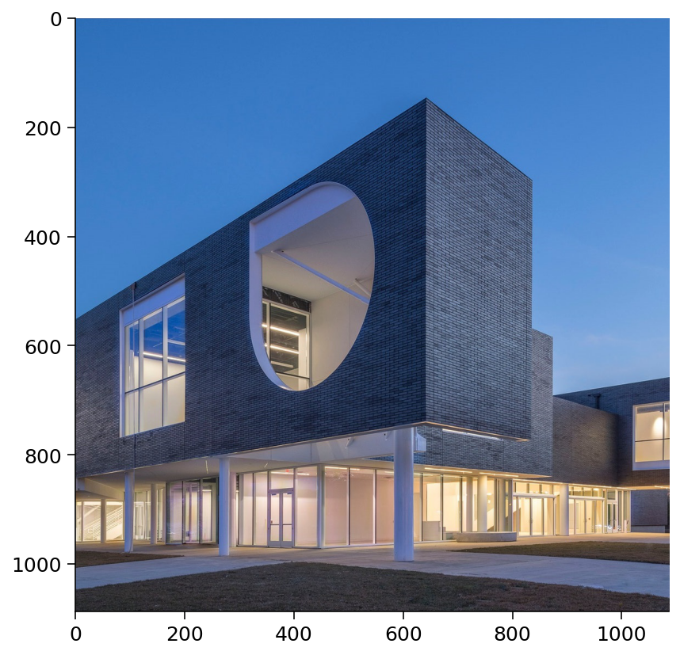
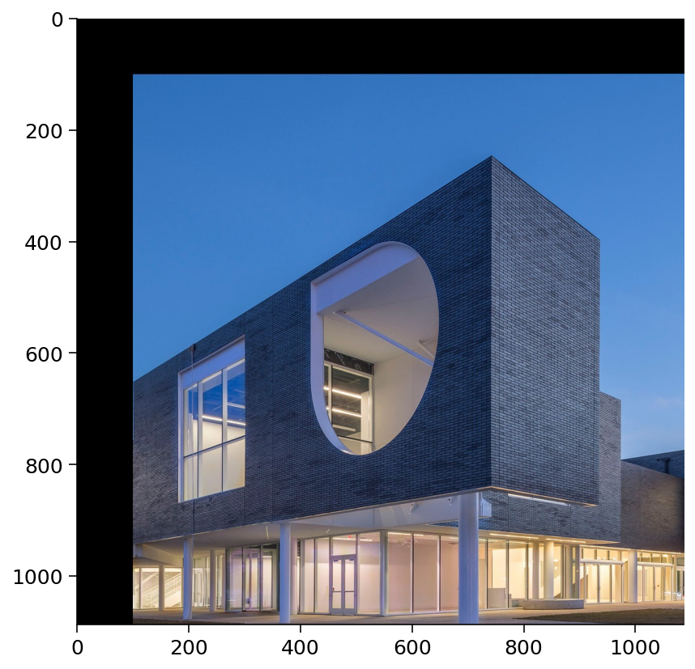
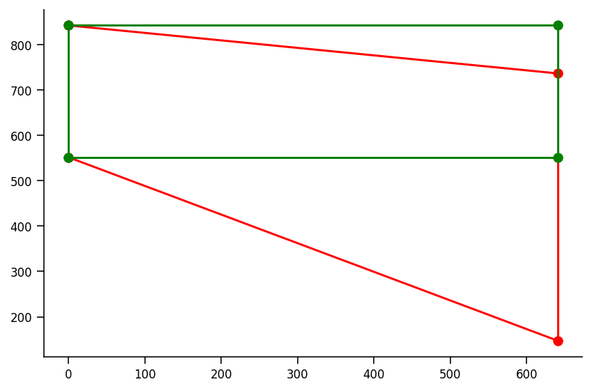
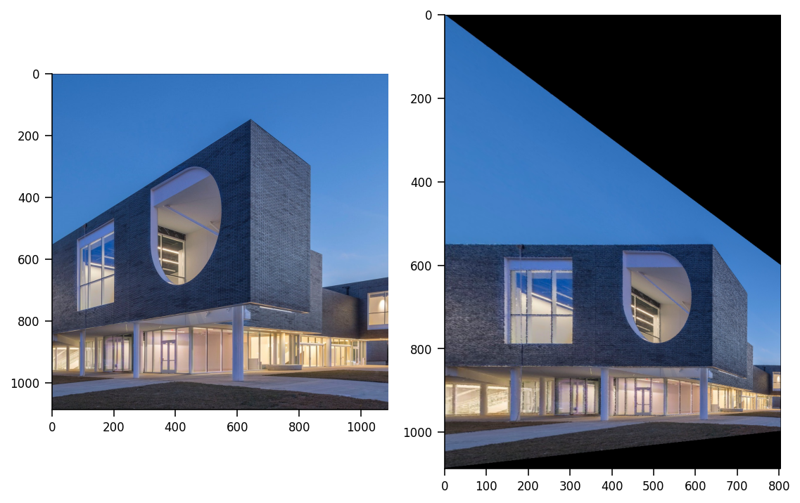

# <div style="text-align:center">Một số các phép biến hình trong không gian xạ ảnh và ứng dụng của chúng trong hiệu chỉnh Projection distortion và Barrel distortion</div>
<div style="text-align:center"> Giảng viên hướng dẫn: Trần Thị Hiếu Nghĩa</div>
<div style="text-align:center"> Tác giả: Đinh Minh Hải</div>
<div style="text-align:center"> Học phần: Hình học sơ cấp</div>
<div style="text-align:center"> Mã lớp học phần: MATH142903</div>
<div style="text-align:center"> MSSV: 4501101017</div>


---
---

## 1. Đặt vấn đề (Introduction)
***

Các vật thể bị biến dạng xuất phát từ quá trình thu ảnh qua camera tạo ra sai lệch về mặt kích thước, hình dạng, tỉ lệ của các vật thể với nhau và so với thực tế. Do đó, trong các ngành có yêu cầu cao về độ sạch của các dữ liệu hình ảnh như “Thị giác máy tính” (CV - Computer Vision), người ta phải xử lý các hình ảnh, đặc biệt là những hình ảnh bị biến dạng trước khi đưa vào sử dụng làm dữ liệu cho các mô hình học máy. 

Một phần nhỏ trong các phương pháp tiền xử lý ảnh là các phép biến hình, dời hình mà tôi vô cùng quen thuộc trong học phần "Hình học sơ cấp". Vì vậy, tôi đã đi vào nghiên cứu cách ứng dụng chúng để xử lý Projective distortion và Barrel distortion - là hai trong nhiều loại biến dạng thường gặp nhất khi chụp ảnh. 

## 2. Cơ sở toán học (Preliminaries)
***

Cơ sở toán học sẽ trình bày về 2D points, 2D line và các phép biến đổi(transformation) trong mặt phẳng 2 chiều

### 2.1 Điểm 2-chiều (2D point)

Điểm 2-chiều $\textbf{x}$ (2D points) được biểu diễn bằng cách sử dụng cặp giá trị $(x,y) \in \mathbb{R}^2$, hay ta có một cách viết khác là 

$$ \textbf{x} = \left[\begin{matrix} x \\ y \end{matrix}\right]$$

Trong hệ tọa độ thuần nhất $\textit{(homogeneous coordinates)}$, $\tilde{\textbf{x}} = \left( \tilde{x}, \tilde{y}, \tilde{w}\right) \in \mathcal{P}^2$, trong đó các vector chỉ khác biệt về tỉ lệ được xem là tương đương.
$\mathcal{P}^2 = \mathcal{R}^3 - (0,0,0)$ được gọi là không gian xạ ảnh 2-chiều $\textit{(2D projective space)}$

Một vector thuần nhất $\tilde{\textbf{x}} \textit{ (homogeneous vector)}$ có thể được chuyển thành vector không thuần nhất bằng các chia cho thành tố cuối cùng $\tilde{w}$

$$\tilde{\textbf{x}}= \left( \tilde{x}, \tilde{y}, \tilde{w}\right) = \tilde{w} \left( x, y, 1\right) = \tilde{w}\bar{\textbf{x}}$$

trong đó $\bar{\textbf{x}} = \left( x, y, 1\right)$ là vector bổ sung $\textit{(augmented vector)}$. Các vector thuần nhất có thành tố thứ ba $\tilde{w} = 0$ được gọi là điểm lý tưởng $\textit{(ideal point)}$ hay điểm ở vô cực $\textit{(point at infinity)}$, không có vector không thuần nhất tương đương.

### 2.2 Đường thẳng 2-chiều (2D line) 

Các đường thẳng 2-chiều có thể được biểu diễn dưới dạng tọa độ thuần nhất $\tilde{l}=(a, b, c)$. Phương trình đường thẳng tương ứng là

$$
\tilde{\boldsymbol{l}}^T \overline{\boldsymbol{x}} =a x+b y+c=0
$$

Vì các tọa độ thuần nhất sai khác nhau một tỉ số là tương đương, ta có thể chuẩn hóa $\boldsymbol{l}=\left(\frac{a}{\sqrt{a^2 + b^2}},\frac{b}{\sqrt{a^2 + b^2}},\frac{c}{\sqrt{a^2 + b^2}}\right)=\left(\hat{n}_x, \hat{n}_y, d\right)=(\hat{\boldsymbol{n}}, d)$ với chuẩn Euclid của $\hat{\boldsymbol{n}}$, $\|\hat{\boldsymbol{n}}\|=1$. Khi đó, $\hat{\boldsymbol{n}}$ là một vector chuẩn vuông góc với đường thẳng và khoảng cách từ gốc tọa độ đến chính đường thẳng bằng chính $d$. Ngoài ra, công thức trên cũng được dùng để xác định một điểm có nằm trên đường thẳng trong tọa độ thuần nhất hay không.

Về giao điểm của hai đường thẳng, nó có thể được xác định là tích có hướng của tọa độ thuần nhất của hai đường thẳng.
Cho $\tilde{\boldsymbol{l}}_1, \tilde{\boldsymbol{l}}_2$, khi đó giao điểm $\tilde{\boldsymbol{x}}$ được tính như sau

$$
\tilde{\boldsymbol{x}}=\tilde{\boldsymbol{l}}_1 \times \tilde{\boldsymbol{l}}_2
$$

Ngược lại, một đường thẳng đi qua hai điểm cũng có thể được xác định bằng tích có hưởng của hai điểm đó.
Cho $\tilde{\boldsymbol{x}}_1, \tilde{\boldsymbol{x}}_2$, đường thẳng nối hai điểm trên là $\tilde{\boldsymbol{l}}$ xác định bởi

$$
\tilde{\boldsymbol{l}} = \tilde{\boldsymbol{x}}_1 \times \tilde{\boldsymbol{x}}_2
$$

### 2.3 Phép biến hình 2-chiều (2D transformations)

#### 2.3.1 Phép tịnh tiến

Phép tịnh tiến hai chiều $x'=x+t$ được viết dưới dạng ma trận như sau

$$x' = \left[ \begin{matrix} I & t\end{matrix}\right]\bar{x}$$

trong đó $I$ là ma trận đơn vị cỡ $2\times 2$ hay viết dưới dạng

$$\bar{x}' = \begin{bmatrix} I & t \\ \textbf{0}^T & 1\end{bmatrix}\bar{x}$$

trong đó $\textbf{0}$ là vector 0.

Công thức dùng ma trận $2 \times 2$ cho ta biểu diễn phép quay 2-chiều xúc tích hơn. Tuy nhiên, việc sử dụng ma trận biến đổi $3\times 3$ tạo điều kiện thuận lợi để thực hiện một chuỗi các biến đổi $\textit{(chain transformations)}$ liên tiếp.

#### 2.3.2 Phép quay + phép tịnh tiến


Phép biến đổi này bảo toàn khoảng cách Euclid nên thường được gọi với cái tên phép biến đổi 2-chiều Euclid $\textit{(2D Euclidean transformation})$ hay $\textit{(2D rigid body transformation)}$. Nó được biểu diễn bằng 3 cách như sau:
$$x'=Rx+t$$

$$x' = \begin{bmatrix} R & t\end{bmatrix}\bar{x}$$

$$\bar{x}' = \begin{bmatrix} R & t \\ \textbf{0}^T & 1\end{bmatrix}\bar{x}$$

trong đó $R = \begin{bmatrix} cos\theta & -sin\theta \\ sin\theta & cos\theta \end{bmatrix}$ là một ma trận quay trực giao với $RR^T=I$ và $det(R) = 1$

Dựa trên công thức của phép quay + phép tịnh tiến, lấy $O$ là tâm của phép quay, ta dễ dàng ký hiệu phép dời hình này là $T_{\vec{t}}\circ Q^{\alpha}_O$, mà dạng chính tắc của nó là phép quay tâm $O'$ nào đó một góc $\alpha$, ký hiệu $Q^{\alpha}_{O'}$. Khi này, ta có thể xây dựng ma trận của một phép quay tâm $\mathcal{C} = (x_{\mathcal{C}}, y_{\mathcal{C}})$ bất kỳ như sau.

Ta sẽ cố gắng phân tích $Q_{\mathcal{C}}^{\alpha} = T_{\vec{a}} \circ Q_{O}^{\alpha}$ 

Dựng đường thằng $d_3$ đi qua $O$ và $\mathcal{C}$, sau đó dựa trên kết quả của quá trình xây dựng dạng chính tắc của tích hai phép dời hình $T_{\vec{t}}\circ Q^{\alpha}_O$, ta biết được $\mathcal{C}$ cần là giao điểm của $d_3$ và 
một đường $d_2$ nào đó là ảnh qua phép tịnh tiến theo vector $\frac{1}{2}\vec{a}$ đường thẳng $d_1$. Nhiệm vụ quan trọng lúc này là xác định được $\vec{a}$ thỏa các điều kiện trên.

Với $\alpha$ cho trước, ta xác định được $d_1=Q^{\alpha /2}_O$. Lấy $D$ đối xứng với $\mathcal{C}$ qua $d_{1}$. Dễ thấy $D \in (O,O\mathcal{C})$. Nếu $D\mathcal{C} \cap d_{1} = B$ thì $\vec{B\mathcal{C}} = \frac{1}{2}\vec{D\mathcal{C}}=\frac{1}{2}\vec{a}$. Thật vậy, $T_{\vec{BC}}(d_1)=d_2$ và $d_2\cap d_3 = \mathcal{C}$. Vậy, ta đã xác định được vector $\vec{a}$. 


Figure 1. Minh họa quy trình xác định $\vec{a}$


Khi này dễ chứng minh được 
$D = Q_{O}^{\alpha} = \begin{bmatrix} cos\theta \cdot x_{\mathcal{C}} -sin\theta \cdot y_{\mathcal{C}} \\ sin\theta \cdot x_{\mathcal{C}}  +cos\theta \cdot y_{\mathcal{C}}\end{bmatrix}$ và $\vec{a} = \vec{O\mathcal{C}} - \vec{OD} = \begin{bmatrix} (1-cos\theta)x_{\mathcal{C}} + sin\theta \cdot y_{\mathcal{C}} \\ -sin\theta \cdot x_\mathcal{C}  + (1-cos\theta)y_{\mathcal{C}} \end{bmatrix}$ cùng với kết quả quan trọng $Q_{\mathcal{C}}^{\alpha} = T_{\vec{a}} \circ Q_{O}^{\alpha}$

Như vậy ma trận quay tâm $\mathcal{C}$ bất kỳ là $\begin{bmatrix} R & a \end{bmatrix}$. Công thức của ma trận quay tâm $\mathcal{C}$ cụ thể là 

$$x' = \begin{bmatrix} R & a \end{bmatrix}\bar{x}$$


#### 2.3.3 Phép đồng dạng (Similarity transform)
Phép đồng dạng được biểu diễn là $x' = sRx+t$ trong đó $s$ là nhân tử tỉ lệ tùy ý. Nó còn được viết lại bằng cách sử dụng ma trận $2\times 2$ và $3\times 3$ như sau

$$x' = \left[ \begin{matrix} sR & t\end{matrix}\right]\bar{x}=\begin{bmatrix} a & -b & t_x \\ b & a & t_y \end{bmatrix}\bar{x}$$

$$\bar{x}' = \begin{bmatrix} sR & t \\ \textbf{0}^T & 1\end{bmatrix}\bar{x}=\begin{bmatrix} a & -b & t_x \\ b & a & t_y \\ 0 & 0 & 1\end{bmatrix}\bar{x}$$

với $a,b$ không cần phải thỏa $a^2 + b^2 = 1$. 

Bằng cách xem $sR = R'$, phép đồng dạng với tâm quay bất kỳ dễ dàng được xây dựng theo quy trình tương tự như ở mục 2.2.2

Phép đồng dạng bảo toàn góc giữa các đường thẳng.


#### 2.3.4 Phép biến đổi Affine (Affine transformation)
Phép biến đổi Affine được biểu diễn bằng công thức $x'=A\bar{x}$, với $A$ là một ma trận $2\times 3$ tùy ý. Hay

$$x' = \begin{bmatrix} a_{00} & a_{01} & a_{02} \\ a_{10} & a_{11} & a_{12} \end{bmatrix}\bar{x}$$

$$\bar{x}' = \begin{bmatrix} a_{00} & a_{01} & a_{02} \\ a_{10} & a_{11} & a_{12} \\ 0 & 0 & 1\end{bmatrix}\bar{x}$$

Qua phép biến đổi Affine các đường thẳng song song bảo toàn tính song song giữa chúng.


#### 2.3.5 Phép biến đổi xạ ảnh (Projective)
Ta có định nghĩa và định lý sau

<b>Định nghĩa.</b>
Một xạ ảnh $\textit{(projectivity)}$ là một ánh xạ khả nghịch $h:\mathbb{P}^2\to\mathbb{P}^2$ biến $3$ điểm thẳng hàng $\mathbf{x}_1, \mathbf{x}_2$ and $\mathbf{x}_3$ thành $3$ điểm thẳng hàng $h\left(\mathbf{x}_1\right), h\left(\mathbf{x}_2\right)$ và $h\left(\mathbf{x}_3\right)$.

<b>Định lý 2.3.5.</b> Một ánh xạ $h: \mathbb{P}^2 \rightarrow \mathbb{P}^2$ là một xạ ảnh khi và chỉ khi tồn tại một ma trận không suy biến $\tilde{H}$ cỡ $3 \times 3$  sao cho một điểm bất kỳ trên $\mathbb{P}^2$ đều được biểu diễn bởi $\mathbf{x}$, hay $h(\mathbf{x})=\tilde{H}\mathbf{x}$.

Khi này phép biến đổi xạ ảnh là hệ quả của sự xác định một xạ ảnh $\textit{(projectivity) } h:\mathbb{P}^2\to\mathbb{P}^2$ thông qua một ma trận $3\times 3$ không suy biến $\tilde{H}$.

Phép biến đổi xạ ảnh, còn được biết đến như là biến đổi phối cảnh $\textit{(perspective transform)}$ hay $\textit{(homography)}$
hoạt động trên hệ tọa độ thuần nhất.

$$\tilde{\textbf{x}}'=\tilde{H}\tilde{\textbf{x}}$$

trong đó $\tilde{H}$ là một ma trận $3 \times 3$ thuần nhất không suy biến, nghĩa là các ma trận sẽ tương đương với nhau nếu chúng sai khác nhau một tỉ lệ nào đó. Tọa độ vector thuần nhất qua phép biến đổi $\tilde{\textbf{x}}'$ có thể được chuẩn hóa để nhận lại vector không thuần nhất $\textbf{x}$. Cụ thể,

$$x'= \dfrac{h_{00}x + h_{01}y + h_{02}}{h_{20}x + h_{21}y + h_{22}}\textrm{ và }y'= \dfrac{h_{10}x + h_{11}y + h_{12}}{h_{20}x + h_{21}y + h_{22}}$$


Phép biến đổi phối cảnh bảo toàn các đường thẳng. Thật vậy, với $\tilde{x}_1,\tilde{x}_2,\tilde{x}_3$ thẳng hàng và $\tilde{x}_j^{'}=\tilde{H}\tilde{x}_j$ với $j = \overline{1,3}$ . Ta có $\tilde{l}=\tilde{x}_1\times \tilde{x}_2$ thì $\tilde{l}^T \bar{x}_j = 0 =(\tilde{l}^T \bar{x}_j)^T =  \bar{x}_j^T \tilde{l}, j=\overline{1,3}$. Khi đó $0=\tilde{l}^T \bar{x}_j=\tilde{l}^T \tilde{H}^{-1}\tilde{H}\bar{x}_j=(\tilde{l}^T \tilde{H}^{-1}\tilde{H}\bar{x}_j)^{T}=(\tilde{H}\bar{x}_j)^{T}(\tilde{l}^T \tilde{H}^{-1})^T=\bar{x}_j^{'T}\tilde{H}^{-T}\tilde{l}=(\tilde{H}^{-T}\tilde{l})^T\bar{x}_j^{'}=\tilde{l}^{'T}\bar{x}_j^{'}$

## 3. Giải quyết vấn đề (Methods)
***

### 3.1. Chương trình các phép biến hình

Đầu tiên tôi tải các thư viện Python cần sử dụng


```python
import numpy as np
import matplotlib.pyplot as plt
import os
import matplotlib.image as mpimg
import cv2
from PIL import Image
import requests

```


```python
# @title Figure Settings
import ipywidgets as widgets  # interactive display
%config InlineBackend.figure_format = 'retina'
plt.style.use("https://raw.githubusercontent.com/NeuromatchAcademy/course-content/main/nma.mplstyle")
```


```python
# url = 'https://drive.google.com/uc?export=view&id=1lAH8jt2ssTZCpUc2wnVfaWrI3rFnPbzv'
url = 'https://drive.google.com/uc?export=view&id=1NGn4iHxvjMztOLj2Fqw9_fIK6tlXw76B'
image_raw = Image.open(requests.get(url, stream=True).raw)

img = np.array(image_raw)
im = np.array(image_raw)
rows, cols, height = img.shape
Z=img
angle = 5
matrix = cv2.getRotationMatrix2D((rows/2, cols/2), angle, 1)
```


```python
Z.shape
```


    (1087, 1087, 3)


```python
def release_black_dot(img):
    ''' 
    '''
    for i in range(1,1086):
        for j in range(1, 1086):
            if img[i,j-1].all() != 0 and img[i,j].all() == 0 and img[i,j+1].all() != 0:
                img[i,j] = img[i,j-1]
            else:
                continue
    return img
            
def warpmatrix_to_img(Z, matrix):
    ''' Warp matrix to rotate the image
    :param Z: the image ndarray
    :param matrix: the rotation matrix
    '''
    a = np.zeros(Z.shape)
    for i in range(Z.shape[0]):
        for j in range(Z.shape[1]):
            coor = np.round(matrix @ np.array([i,j,1]).T).astype(int)
        #     print(coor)
            if coor[0] < 0 or coor[1] < 0:
                continue
            elif coor[0] >= Z.shape[0] or coor[1] >= Z.shape[1]:
                continue
            else:
                a[coor[0],coor[1]] = Z[i,j]
    return a.astype(int)

def warpmatrix_translation_to_img(Z, matrix):
    ''' Warp matrix to translation the image
    :param Z: the image ndarray
    :param matrix: the translation matrix
    '''
    a = np.zeros(Z.shape)
    for i in range(Z.shape[0]):
        for j in range(Z.shape[1]):
            coor = np.round(matrix @ np.array([j,i,1]).T).astype(int)
        #     print(coor)
            if coor[0] < 0 or coor[1] < 0:
                continue
            elif coor[0] >= Z.shape[0] or coor[1] >= Z.shape[1]:
                continue
            else:
                a[coor[0],coor[1]] = Z[i,j]
    return np.transpose(a,axes = (1,0,2)).astype(int)

def warpmatrix_projective_translation_to_img(Z, matrix,):
    a = np.zeros(Z.shape)
    for i in range(Z.shape(0)):
        for j in range(Z.shape(1)):
            coor = matrix @ np.array([j,i,1]).T
            coor[0] = np.round(coor[0]/coor[2])
#             print('coor[0]:', coor[0])
            coor[1] = np.round(coor[1]/coor[2])
#             print('coor[1]:', coor[1])
            coor = coor.astype(int)
            if coor[0] < 0 or coor[1] < 0:
                continue
            elif coor[0] >= Z.shape[0] or coor[1] >= Z.shape[1]:
                continue
            else:
                a[coor[0],coor[1]] = Z[i,j]
    return a.astype(int) #np.transpose(a,axes = (1,0,2)).astype(int)

def getRotationMatrix2D(center, angle, scale):
    ''' Obtain the Rotation matrix with given rotation center, angle and scale
    :param center: center of the rotation
    :param angle: the angle of the rotation
    :param scale: the scale ratio
    '''
    a = scale*np.cos(np.deg2rad(angle))
    b = scale*np.sin(np.deg2rad(angle))
    matrix = np.array([[a,-b,(1-a)*center[0] + b*center[1]],[b,a, -b*center[0] + (1-a)*center[1]]])
    return matrix
```

Hình bên dưới là tấm hình gốc mà tôi sử dụng cho toàn bộ bài tiểu luận này. Có một số nội dung quan trọng chúng ta cần lưu ý:

Thứ nhất, nhằm tạo thuận lợi cho thuật toán hiển thị hình ảnh thì gốc (điểm có tọa độ $(0,0)$) của hình) nằm ở góc phía trên bên trái, các điểm trong ảnh hiển thị theo tọa độ của điểm ảnh (pixel) là tọa độ nguyên do đó trong quá trình tính toán ảnh của một điểm qua phép biến hình nếu có xuất hiện tọa độ thực, ta phải có cách xử lý phù hợp.

Thứ hai, khi chúng ta điều chỉnh bất kỳ một tham số nào trong phép biến hình, thì đoạn chương trình sẽ quay lại tác động lên bức ảnh gốc và xuất ra kết quả thay vì tác động lên kết quả trước đó. Chi tiết hơn dành cho lưu ý này có ở phần đánh giá phía dưới chương trình thực hiện phép tịnh tiến.


```python
plt.imshow(img)
```


    <matplotlib.image.AxesImage at 0x7f0a8c9af280>


    

    


Phía trên phần hiển thị ảnh có các thanh trượt, bằng các sử dụng các thanh trượt này, chúng ta có thể điều chỉnh các tham số cho các phép biến hình. 


```python
# Translation: tịnh tiến
shiftX = 0
shiftY = 0

@widgets.interact(shiftX = widgets.FloatSlider(value=0, min=0, max=1000, step=1),
                  shiftY = widgets.FloatSlider(value=0, min=0, max=1000, step=1))
def visualize_translation(shiftX = 0,shiftY = 0):
    # Ma trận của phép tịnh tiến
    matrix = np.array([[1,0,shiftX],[0,1,shiftY]])
    new_img = warpmatrix_translation_to_img(img, matrix)
    plt.imshow(new_img)
```


    interactive(children=(FloatSlider(value=0.0, description='shiftX', max=1000.0, step=1.0), FloatSlider(value=0.…


Như đã đề cập sơ lược trong lưu ý số 2, ta có thể thấy quá trình di chuyển thanh trượt ```shiftX``` đến giá trị 100, máy tính sẽ chạy chương trình và tịnh tiến bức ảnh theo vector tương ứng. Khi này gốc tọa độ của bức hình được hiển thị là một pixel màu đen, ta tiếp tục thay đổi giá trị ```shiftX``` lên 150 thì chương trình sẽ không tịnh tiến bức hình vừa mới hiển thị qua trái 150px, thay vào đó, nó bỏ qua kết quả vừa hiển thị, coi các giá trị ```shiftX, shiftY``` mới và tấm hình gốc của bài tiểu luận này là input để chạy chương trình và in ra kết quả.

Trở lại với nội dung chính, ```shiftX, shiftY``` là tọa độ của vector tịnh tiến. Ma trận tịnh tiến được sử dụng ở chương trình trên là ```matrix```với 

```matrix``` $= \begin{bmatrix}1 & 0 & shiftX \\ 0 & 1 & shiftY \end{bmatrix}$. 

Việc thay đổi ```shiftX, shiftY``` bằng thanh trượt lần lượt làm cho bức hình dịch chuyển theo phương ngang và phương dọc. Như vậy, chúng ta không thể thay đổi đồng thời ```shiftX, shiftY``` nên thao tác tịnh tiến theo một vector bất kỳ $T_{\vec{c}}$ chẳng hạn $\vec{c} = (100, 100)$ được chuyển thành tích của hai phép tịnh tiến $T_{\vec{b}}\circ T_{\vec{a}}$ với $\vec{a}, \vec{b} = (100,0), (0,100)$ và ngược lại, tùy theo việc ta thay đổi ```shiftX``` hay ```shiftY``` trước.

Chương trình phía dưới là một phiên bản khác của chương trình tịnh tiến bức ảnh, được đặc trưng bởi khả năng xác lập giá trị của vector tịnh tiến trước khi thực hiện xuất ra kết quả của phép tịnh tiến.


```python
# Translation: tịnh tiến
sx = widgets.IntText(
    value=100,
    description='shiftX:',
    disabled=False
)
display(sx)
textsx = widgets.Text()
sy = widgets.IntText(
    value=100,
    description='shiftY:',
    disabled=False
)
display(sy)
buton =  widgets.Button(description = 'translation')
display(buton)


# @widgets.interact(shiftX = widgets.IntText(value=100, description='shiftX:', disabled=False),
#                   shiftY = widgets.IntText(value=100, description='shiftX:', disabled=False))
def visualize_translation(b):
    shiftX = sx.value
    shiftY = sy.value
    # Ma trận của phép tịnh tiến
    matrix = np.array([[1,0,shiftX],[0,1,shiftY]])
    new_img = warpmatrix_translation_to_img(img, matrix)
    print("Vector tịnh tiến: t = ({},{})".format(shiftX,shiftY))
    plt.imshow(new_img)
buton.on_click(visualize_translation)

```


    IntText(value=100, description='shiftX:')


    IntText(value=100, description='shiftY:')


    Button(description='translation', style=ButtonStyle())


    Vector tịnh tiến: t = (100,100)
    


    

    


```python
# Rotation: phép quay
@widgets.interact(angle = widgets.FloatSlider(value=.2, min=0, max=180,step=1))
def visualize(angle = 0):
#     matrix = getRotationMatrix2D((rows/2, cols/2), angle, 0.5)
    matrix = getRotationMatrix2D((0,0), angle, 0.5)
    new_img = warpmatrix_to_img(img, matrix)
    plt.imshow(release_black_dot(new_img).astype(int))
```


    interactive(children=(FloatSlider(value=0.2, description='angle', max=180.0, step=1.0), Output()), _dom_classe…


```python
# Phép biến đổi rigid(Euclidean)
shiftX = 0
shiftY = 0

@widgets.interact(theta = widgets.FloatSlider(value = 0, min=0, max=180, step = 1),
                  shiftX = widgets.FloatSlider(value=0, min=0, max=1000, step=1),
                  shiftY = widgets.FloatSlider(value=0, min=0, max=1000, step=1))
def visualize_translation(theta = 0, shiftX = 0,shiftY = 0):
    a11 = np.cos(np.deg2rad(theta))
    a12 = -np.sin(np.deg2rad(theta)) 
    a21 = np.sin(np.deg2rad(theta)) 
    a22 = np.cos(np.deg2rad(theta))
    matrix = np.array([[a11,-a12,shiftX],[-a21,a22,shiftY]])
    new_img = warpmatrix_translation_to_img(img, matrix)
    Z = img
    plt.imshow(new_img)
```


    interactive(children=(FloatSlider(value=0.0, description='theta', max=180.0, step=1.0), FloatSlider(value=0.0,…


```python
# Affine transformation
shiftX = 0
shiftY = 0

@widgets.interact(a00 = widgets.FloatSlider(value = 0.8, min=0.3, max=1.3, step = 0.1),
                  a01 = widgets.FloatSlider(value = 0.1, min=-0.4, max=0.6, step = 0.1),
                  a02 = widgets.FloatSlider(value = 1, min=0.5, max=1.5, step = 0.1),
                  a10 = widgets.FloatSlider(value = 0.3, min=-0.2, max=0.8, step = 0.1),
                  a11 = widgets.FloatSlider(value = 1, min=-1, max=3, step = 0.5),
                  a12 = widgets.FloatSlider(value = 0, min=-2, max=2, step = 0.5))
def visualize_translation(a00=0, a01=0, a02=0, a10=0, a11=0, a12=0):
    matrix = np.array([[a00,a01,a02],[a10,a11,a12]])
    new_img = cv2.warpAffine(img, matrix,(0,0))
    Z = img
    plt.imshow(new_img)
```


    interactive(children=(FloatSlider(value=0.8, description='a00', max=1.3, min=0.3), FloatSlider(value=0.1, desc…


```python
# Projective transformation

@widgets.interact(h00 = widgets.FloatSlider(value = 1, min=1, max=10, step = 1),
                  h01 = widgets.FloatSlider(value = 0.1, min=-0.4, max=0.6, step = 0.1),
                  h02 = widgets.FloatSlider(value = 1, min=0.5, max=1.5, step = 0.1),
                  h10 = widgets.FloatSlider(value = 0.3, min=-0.2, max=0.8, step = 0.1),
                  h11 = widgets.FloatSlider(value = 1, min=-1, max=3, step = 0.5),
                  h12 = widgets.FloatSlider(value = 0, min=-2, max=2, step = 0.5),
                  h20 = widgets.FloatSlider(value = 0, min=-1.9, max=2.1, step = 0.1),
                  h21 = widgets.FloatSlider(value = 0, min=-1.9, max=2.1, step = 0.1),
                  h22 = widgets.FloatSlider(value = 1, min=-2, max=2, step = 0.5),)
def visualize_translation(h00=0.8, h01=0.1, h02=1, h10=0.3, h11=1, h12=0, h20=0, h21=0, h22=1):
    matrix = np.array([[h00,h01,h02],[h10,h11,h12],[h20,h21,h22]])
    new_img = cv2.warpPerspective(img, matrix,(2000,2000))
    Z = img
    plt.imshow(new_img)
    cv2.imwrite("building.png",new_img)
    
```


    interactive(children=(FloatSlider(value=1.0, description='h00', max=10.0, min=1.0, step=1.0), FloatSlider(valu…


```python
# Projective transformation

@widgets.interact(h00 = widgets.FloatSlider(value = 1, min=1, max=10, step = 1),
                  h01 = widgets.FloatSlider(value = 0.1, min=-0.4, max=0.6, step = 0.1),
                  h02 = widgets.FloatSlider(value = 1, min=0.5, max=1.5, step = 0.1),
                  h10 = widgets.FloatSlider(value = 0.3, min=-0.2, max=0.8, step = 0.1),
                  h11 = widgets.FloatSlider(value = 1, min=-1, max=3, step = 0.5),
                  h12 = widgets.FloatSlider(value = 0, min=-2, max=2, step = 0.5),
                  h20 = widgets.FloatSlider(value = 0, min=-1.9, max=2.1, step = 0.1),
                  h21 = widgets.FloatSlider(value = 0, min=-1.9, max=2.1, step = 0.1),
                  h22 = widgets.FloatSlider(value = 1, min=-2, max=2, step = 0.5),)
def visualize_translation(h00=0.8, h01=0.1, h02=1, h10=0.3, h11=1, h12=0, h20=0, h21=0, h22=1):
    matrix = np.array([[h00,h01,h02],[h10,h11,h12],[h20,h21,h22]])
    new_img = cv2.warpPerspective(img, matrix,(1000,1000))
    Z = img
    plt.imshow(new_img)
    cv2.imwrite("building.png",new_img)
    
```


    interactive(children=(FloatSlider(value=1.0, description='h00', max=10.0, min=1.0, step=1.0), FloatSlider(valu…


### 3.2 Xử lý projective distortion

Ta có bức hình sau


Trong hệ tọa độ thuần nhất, hai đường thẳng song song sẽ gặp nhau tại điểm ở vô cực $\textit{(point at infinity)}$ nhưng đối với bức hình này, mép trên và mép dưới của tòa nhà là các đường thẳng sẽ cắt nhau tại một điểm hữu hạn trong trường hợp chúng ta vẽ thêm. Xuất phát từ các phép chiều 3D sang 2D khi chụp ảnh đã không bảo toàn tính song song, người ta thường gọi hiện tượng này là biến dạng xạ ảnh $\textit{(projective distortion)}$

Sự biến dạng xạ ảnh $\textit{(projective distortion)}$ thường nằm ngoài chủ đích của người chụp ảnh. Trong trường hợp chúng ta muốn loại bỏ biến dạng xạ ảnh, ta có thể sử dụng định lý 2.3.5 và phép biến đổi xạ ảnh mặt phẳng rút ra từ ma trận biến đổi $\tilde{H}$

Đầu tiên, ta chọn 4 điểm $\tilde{x}_i$ thuộc một mặt bất kỳ của tòa nhà, sao cho 4 điểm đó là 4 đỉnh của một hình chữ nhật khi không xảy ra hiện tượng biến dạng xạ ảnh $\textit{(projective distortion)}$ và có thể nhận được 4 đỉnh $\tilde{x}_i'$ của hình chữ nhật từ đó.

Bằng cách, tìm một xạ ảnh $h$ thỏa $\tilde{x}_i'=\tilde{H}\tilde{x}_i, i = \overline{1,4}$ và áp dụng cho tất cả các điểm còn lại, ta sẽ được một tấm ảnh không biến dạng. 

Thuật toán tôi sử dụng để tìm $H$ (vì $H$ tương đương với $\tilde{H}$ khi $\tilde{H} = h_{33}H$) là Direct Linear Transformation ở dạng chuẩn hóa

Ta có ${\mathrm{x}}_i=\left(x_i, y_i, w_i\right)^{\top},{\mathrm{x}}_i^{\prime}=\left(x_i^{\prime}, y_i^{\prime}, w_i^{\prime}\right)^{\top}$,   ${\mathrm{x}}_i^{\prime}={H}{\mathrm{x}}_i$,  ${\mathrm{x}}_i^{\prime} \times {H}{\mathrm{x}}_i=0$ với $i=\overline{1,4}$

${H} = \begin{bmatrix} h_{11}& h_{12}& h_{13} \\ h_{21}& h_{22}& h_{23}\\h_{31}& h_{32}& h_{33} \end{bmatrix} = \begin{bmatrix}\mathrm{h}^{1^{\top}} \\ \mathrm{h}^{2^{\top}} \\ \mathrm{h}^{3^{\top}}\end{bmatrix}$. Khi đó, $ {H}\mathrm{x}_i=\begin{bmatrix}\mathrm{h}^{1^{\top}} {\mathrm{x}}_i \\ \mathrm{h}^{2^{\top}} {\mathrm{x}}_i \\ \mathrm{h}^{3^{\top}} {\mathrm{x}}_i\end{bmatrix}$

Ta tính được
${\mathrm{x}}_i^{\prime} \times {H}{\mathrm{x}}_i=\begin{bmatrix}y_i^{\prime} \mathrm{h}^{3^{\top}} \mathrm{x}_i-w_i^{\prime} \mathrm{h}^{2^{\top}} \mathrm{x}_i \\ w_i^{\prime} \mathrm{h}^{1^{\top}} \mathrm{x}_i-x_i^{\prime} \mathrm{h}^{3^{\top}} \mathrm{x}_i \\ x_i^{\prime} \mathrm{h}^{2^{\top}} \mathrm{x}_i-y_i^{\prime} \mathrm{h}^{1^{\top}} \mathrm{x}_i\end{bmatrix}=\left[\begin{array}{ccc}0^{\top} & -w_i^{\prime} \mathrm{x}_i^{\top} & y_i^{\prime} \mathrm{x}_i^{\top} \\ w_i^{\prime} \mathrm{x}_i^{\top} & 0^{\top} & -x_i^{\prime} \mathrm{x}_i^{\top} \\ -y_i^{\prime} \mathrm{x}_i^{\top} & x_i^{\prime} \mathrm{x}_i^{\top} & 0^{\top}\end{array}\right]\left(\begin{array}{c}\mathrm{h}^1 \\ \mathrm{h}^2 \\ \mathrm{h}^3\end{array}\right)$, trong đó $0^{\top}=(0,0,0)$


Đặt 
$A_i = \left[\begin{array}{ccc}0^{\top} & -w_i^{\prime} \mathrm{x}_i^{\top} & y_i^{\prime} \mathrm{x}_i^{\top} \\ w_i^{\prime} \mathrm{x}_i^{\top} & 0^{\top} & -x_i^{\prime} \mathrm{x}_i^{\top} \\ -y_i^{\prime} \mathrm{x}_i^{\top} & x_i^{\prime} \mathrm{x}_i^{\top} & 0^{\top}\end{array}\right]$, ta có $A_i\mathrm{\mathbf{h}}=0$

Tiếp tục
đặt $A = \begin{pmatrix}A_1\\A_2\\A_3\\A_4\end{pmatrix}$, ta nhận được ma trận $A$ cỡ $12 \times 9$.

Tuy nhiên chỉ có $2$ trong $3$ dòng của $A_i, i = \overline{1,4}$ là độc lập tuyến tính (chứng minh sau), nên ma trận $A$ sau cùng có cỡ $8 \times 9$, cùng với $\mathrm{\mathbf{h}}$ được hình thành từ $H$ có thành tố cuối cùng bằng $1$.
Ta lập được hệ phương trình tuyến tính $A\mathrm{\mathbf{h}}=0$ tám ẩn $h_{ij},i=\overline{1,3},j=\overline{1,3},i^2+j^2 \ne 9$ giải được.


#### 3.2.1 Thuật toán DLT(Direct Linear Transformation)

Đầu vào

Cho $n \geq 4$ cặp điểm 2-chiều tương ứng  $\left\{x_i \leftrightarrow x_i{ }^{\prime}\right\}$, 

Đầu ra

Ma trận xạ ảnh 2-chiều $\mathrm{H}$ sao cho $\mathrm{x}_{i}{ }^{\prime}=\mathrm{Hx}_{i}$

Thuật toán

(i) Với mỗi cặp tương ứng $\mathrm{x}_{i} \leftrightarrow \mathrm{x}_{i}$  tính $\mathrm{A}_{i}$ bằng cách sử dụng 2 dòng đầu tiên

(ii) Gộp $n$ các m trận $\mathrm{A}_{i}$ cỡ $2\times 9$ thành một ma trận $\mathrm{A}$ cỡ $2 n \times 9$

(iii) Tìm $h$

(iv) Xác định ma trận $\mathrm{H}$ từ ánh xạ $\mathrm{h}$

#### 3.2.2 Thuật toán DLT chuẩn hóa
Đầu vào

Cho $n \geq 4$ các điểm 2-chiều tương ứng $\left\{x_i \leftrightarrow x_i{ }^{\prime}\right\}$, hãy tìm ma trận xạ ảnh 2-chiều  $\mathrm{H}$ sao cho $\mathrm{x}_{\mathrm{i}}{ }^{\prime}=\mathrm{Hx}_{\mathrm{i}}$

Thuật toán

(i) Chuẩn hóa các điểm đầu vào $\quad \widetilde{\mathrm{x}}_{\mathrm{i}}=\mathrm{T}_{\text {norm }} \mathrm{x}_{\mathrm{i}}, \widetilde{\mathrm{x}}_{\mathrm{i}}^{\prime}=\mathrm{T}_{\text {norm }}^{\prime} \mathrm{x}_{\mathrm{i}}^{\prime}$

(ii) Áp dung thuật toán DLT $\quad \widetilde{\mathrm{x}}_{\mathrm{i}} \leftrightarrow \widetilde{\mathrm{x}}_{\mathrm{i}}^{\prime}$,

(iii) Phương pháp giải chuẩn hóa $\textit{(Denormalized solution)}$ $\quad \mathrm{H}=\mathrm{T}_{\text {norm }}^{\prime-1} \widetilde{\mathrm{H}}\mathrm{T}_{\text {norm }}$


```python
import sys
import os
import matplotlib
matplotlib.use("Agg")
%matplotlib inline

from matplotlib import pyplot as plt
from PIL import Image
import numpy as np
import scipy
from scipy import linalg, matrix
from scipy.interpolate import  griddata


def load_image(im):  
    try:
        imx = Image.open(im)
        return np.array(imx)
        # else
    except IOError:
        return []
    
def select_four_points(im):       
     plt.imshow(im)     
     xx = plt.ginput(4)
     xx.append(xx[0])
     print(xx)
     return xx
     
     
def generate_GT(xx):
    plt.figure(2)
 
    zzd = np.zeros((5,3))   
    for ii in range(len(xx)-1):         
#        x2 =xx[ii+1][0]; y2=xx[ii+1][1]
        x1 =xx[ii][0]; y1=xx[ii][1]
        zzd[ii,0] = x1; zzd[ii,1] = y1; zzd[ii,2] = 1; 
        plt.plot([xx[ii][0],xx[ii+1][0]], [xx[ii][1],xx[ii+1][1]], 'ro-') 
    jj = 0
    aa = [0,0,1,0,1,3,0,3]
    zz = np.zeros((5,3))     
    for ii in range(len(zzd)-1):
            zz[ii,0] = zzd[aa[jj],0] 
            zz[ii,1] = zzd[aa[jj+1],1] 
            zz[ii,2] = 1;   
            jj = jj+2
    zz[4,:] = zz[0,:]
    for ii in range(4):      
        plt.plot([zz[ii,0],zz[ii+1,0]], [zz[ii,1],zz[ii+1,1]], 'go-')
    plt.show()
    return zz[0:4,:],zzd[0:4,:]    
        
        
#We have x' = z and x =zd
def normalize_points(zz):
    uu = zz.T
    ff_xx = np.ones(uu.shape)
    indices, = np.where(abs(uu[2,:]) > 10**-12)
    ff_xx[0:2,indices] = uu[0:2,indices]/uu[2,indices]
    ff_xx[2,indices]  = 1.
    mu = np.mean(ff_xx[0:2,:],axis = 1)
    mu_r = np.zeros((mu.shape[0],ff_xx.shape[1]))
    for ii in range(ff_xx.shape[1]):
        mu_r[:,ii] = mu
    mu_dist = np.mean((np.sum((ff_xx[0:2] - mu_r)**2,axis =0))**0.5)
    scale =  (2**0.5/mu_dist)
    s0 = -scale*mu[0]
    s1 = -scale*mu[1]
    S = np.array([[scale, 0, s0],[0, scale, s1], [0, 0, 1]])
    normalized_zz = S@ff_xx
    return normalized_zz, S
    
def compute_A(uu,vv):
    #build for i =1:4 the matrix Ai
    ## uu=GT = x' in HZ, vv= distorted = x in HZ
    A = np.zeros((2*(uu.shape[0]+1),9))
    jj = 0
    for ii in range(uu.shape[0]+1):
        a = (np.zeros((1,3))[0] )       
        b = (-uu[2,ii] * vv[:,ii]) 
        c =  uu[1,ii] * vv[:,ii]
        d =  uu[2,ii] * vv[:,ii]
        f =  (-uu[0,ii]*vv[:,ii])
        row1 = np.concatenate((a, b, c), axis=None)
        row2 = np.concatenate((d,a,f), axis=None)
        A[jj,:] = row1
        A[jj+1,:] = row2
        jj = jj+2
    return A


def compute_homography(A,T1,T2):
#
    null_space_of_A = -scipy.linalg.null_space(A)
    hh_normalized = np.reshape(null_space_of_A,(3,3)) 
    hh = np.dot(np.linalg.inv(T2),np.dot(hh_normalized,T1))
    return hh

### Transform Image
    
def rgb2gray(imm):
    return np.dot(imm[...,:3], [0.2989, 0.5870, 0.1140])

def image_rebound(mm,nn,hh):
    W = np.array([[1, nn, nn, 1 ],[1, 1, mm, mm],[ 1, 1, 1, 1]])
    ws = np.dot(hh,W)
    ### scaling
    xx = np.vstack((ws[2,:],ws[2,:],ws[2,:]))
    wsX =  np.round(ws/xx)
    bounds = [np.min(wsX[1,:]), np.max(wsX[1,:]),np.min(wsX[0,:]), np.max(wsX[0,:])]
    return bounds


def make_transform(imm,hh):
    imm_gray = rgb2gray(imm)   
    mm,nn = imm.shape[0],imm.shape[1]
    bounds = image_rebound(mm,nn,hh)
    nrows = bounds[1] - bounds[0]
    ncols = bounds[3] - bounds[2]
    s = max(nn,mm)/max(nrows,ncols)
    scale = np.array([[s, 0, 0],[0, s, 0], [0, 0, 1]])
    trasf = scale@hh
    trasf_prec =  np.linalg.inv(trasf)
    bounds = image_rebound(mm,nn,trasf)
    nrows = (bounds[1] - bounds[0]).astype(int)
    ncols = (bounds[3] - bounds[2]).astype(int)
    return bounds, nrows, ncols, trasf, trasf_prec, imm_gray


def get_new_image(nrows,ncols,imm,bounds,trasf_prec,nsamples):
    xx  = np.linspace(1, ncols, ncols)
    yy  = np.linspace(1, nrows, nrows)
    [xi,yi] = np.meshgrid(xx,yy) 
    a0 = np.reshape(xi, -1,order ='F')+bounds[2]
    a1 = np.reshape(yi,-1, order ='F')+bounds[0]
    a2 = np.ones((ncols*nrows))
    uv = np.vstack((a0.T,a1.T,a2.T)) 
    new_trasf = np.dot(trasf_prec,uv)
    val_normalization = np.vstack((new_trasf[2,:],new_trasf[2,:],new_trasf[2,:]))
   
    ### The new transformation
    newT = new_trasf/val_normalization
    
    ### 
    xi = np.reshape(newT[0,:],(nrows,ncols),order ='F') 
    yi = np.reshape(newT[1,:],(nrows,ncols),order ='F')
    cols = imm.shape[1]
    rows = imm.shape[0]
    xxq  = np.linspace(1, rows, rows).astype(int)
    yyq  = np.linspace(1, cols, cols).astype(int)
    [x,y] = np.meshgrid(yyq,xxq) 
    x = (x - 1).astype(int) #Offset x and y relative to region origin.
    y = (y - 1).astype(int) 
        
    ix = np.random.randint(im.shape[1], size=nsamples)
    iy = np.random.randint(im.shape[0], size=nsamples)
    samples = im[iy,ix]
       
    int_im = griddata((iy,ix), samples, (yi,xi))
    
    #Plotting
    fig = plt.figure(figsize=(8, 8))
    columns = 2
    rows = 1
    fig.add_subplot(rows, columns, 1)
    plt.imshow(im)
    fig.add_subplot(rows, columns, 2)
    
    plt.imshow(int_im.astype(np.uint8))
    plt.show()

```


```python
# Chọn 4 điểm trên bức ảnh cần chỉnh sửa
# xx = [(213,13), (543,229),(545,344), (210,327) ,(213,13)]
xx = [(0,552),(641,147),(641,737),(0,843),(0,552)]
zz, zzd = generate_GT(xx)
    
## Chuẩn hóa các điểm and return also scaling matrix
norm_points_distorted, T1_norm = normalize_points(zzd)
norm_points_GT, T2_norm= normalize_points(zz)


A = compute_A(norm_points_GT,norm_points_distorted)
hh =  compute_homography(A,T1_norm,T2_norm)

### 
bounds, nrows, ncols,  trasf, trasf_prec, imm_r = make_transform(im,hh)     
nn,mm  = im.shape[0],im.shape[1]
if max(nn,mm)>1000:
    kk =6
else: kk =5
nsamples = 10**kk
```


    

    


### 3.3 Xử lý Barrel distortion
Barrel distortion đặc trưng bởi tọa độ của các điểm quan sát được trên hình dịch ra ngoài vị trí chính xác của chúng. Các đường thẳng song song trong thực tế xuất hiện là các đường cong trong ảnh. Cụ thể, ta quan sát hình ảnh một tòa nhà như sau:


Các cột trắng, lan can,... của tòa nhà bị cong. Do đó trong trường hợp ta muốn xử lý Barrel Distortion, ta không thể dùng ý tưởng tương tụ như việc xử lý projective distortion - tìm một xạ ảnh 2-chiều để xử lý và thu về ảnh không biến dạng vì xạ ảnh 2-chiều bảo toàn các đường thẳng và do đó không có tác dụng làm phẳng các đường cong. 

Tập hợp các phép xạ ảnh lập thành một nhóm bao trùm nhóm các phép biến đổi Affine, nên không thể xử lý một bức ảnh bị barrel distortion bằng cách sử dụng các phép tịnh tiến, quay, đối xứng, Affine, xạ ảnh như mong muốn ban đầu của tôi.

Trong các nghiên cứu ban đầu về phương pháp làm phẳng một bức ảnh bị biến dạng theo loại "barrel", mô hình đơn giản nhất được dùng để mô tả sự biến dạng là các đa thức bậc thấp, chẳng hạn:
$$
\begin{array}
\hat{x}_c = x(1+\mathcal{k}_1r^2+\mathcal{k}_2r^4)\\
\hat{y}_c = y(1+\mathcal{k}_1r^2+\mathcal{k}_2r^4)
\end{array}
$$
trong đó $r^2 = x^2 + y^2$ và $\mathcal{k}_1,\mathcal{k}_2$ là các tham số biến dạng (Brown 1971)
Khi xác định được $\mathcal{k}_1,\mathcal{k}_2$ thì các tọa độ pixel sau cùng là

$$
x_{s} = fx^{'}_c+c_x \\
y_{s} = fy{'}_c+c_y
$$

Có nhiều kỹ thuật xác định tham số biến dạng như plumb-line method (Brown 1971) hay kỹ thuật sử dụng các mô hình phân tầng chuyển động (tịnh tiến, affine, xạ ảnh) trong chiến lược điều chỉnh thô (coarse-to-fine) cùng với khái niệm hiệu chỉnh một hàm bậc hai (quadratic) tham số biến dạng(Sawhney and Kumar 1999). Các kỹ thuật này là tương đối phức tạp với tôi nên trong khuôn khổ của bài tiểu luận này, tôi không đề cập chi tiết đến chúng.

## 4. Kết quả (Result)
***

Như vậy việc xử lý các bức ảnh bị biến dạng loại "barrel" bằng các phép biến hình 2-chiều được trình bày ở trên là không khả thi. Ta quay lại với kết quả xử lý một bức ảnh gặp phải biến dạng xạ ảnh.


```python
get_new_image(nrows,ncols,im,bounds,trasf_prec,nsamples)
```


    

    


Trong chương trình có đoạn ```xx = [(0,552),(641,147),(641,737),(0,843),(0,552)]```, đây chính là tọa độ 4 điểm của mặt trước tòa nhà mà tôi chọn, riêng giá trị ```(0,522)``` cuối cùng là tọa độ của điểm đầu tiên được xác định để thuật toán vẽ được hình chữ nhật như bức hình ở phía trên.

Mép trên mà mép dưới của tòa nhà sau khi hiệu chỉnh đã trở về trạng thái song song như trong thực tế, điều này cho ta góc nhìn chính diện ngôi nhà. Nó cũng chính là kết quả cuối cùng trong bài tiểu luận của tôi.

## V. Bàn luận
***

Các phép biến hình 2-chiều (tịnh tiến, Affine, xạ ảnh) đóng vai trò rất quan trọng trong việc xử lý ảnh. Nó được ứng dụng rất nhiều trong các phần mềm gõ văn bản, phần mềm trình chiếu như một công cụ không thể thiếu đối với các công việc văn phòng như soạn thảo văn bản, soạn bài thuyết trình,... . Mặt khác, trong giai đoạn tiền xử lý ảnh, các mô hình trên đóng góp rất lớn trong việc xử lý dữ liệu ảnh thô và đặc biệt là quá trình xử lý biến dạng xạ ảnh. Tuy nhiên, đối với các biến dạng phức tạp hơn như Barrel Distortion, việc áp dụng đơn thuần các phép biến hình không đem lại kết quả xử lý mong đợi bởi tính chất bảo toàn đường thẳng của chúng. Song bằng cách áp dụng thêm nhiều kỹ thuật mới, chúng ta có thể xử lý các biến dạng loại "barrel" hay thậm chí ứng dụng các phép tịnh tiến, Affine, xạ vào quá trình xử lý biến dạng. 

Trong tương lai, các phương pháp xử lý biến dạng "barrel" mà đặc biệt là các phương pháp có sử dụng các phép biến hình sẽ là chủ đề mà tôi tiếp tục quan tâm trong việc học tập theo định hướng "Thị giác máy tính" của bản thân.

## VI. Tài liệu tham khảo (Reference)
***


1. Szeliski, R. (2022). Computer vision: algorithms and applications. Springer Nature.
2. Hartley, R., & Zisserman, A. (2003). Multiple view geometry in computer vision. Cambridge university press.
3. Brown, D. C. (1971). Close-range camera calibration. Photogrammetric Engineering, 37(8):855–866.
4. Sawhney, H. S. and Kumar, R. (1999). True multi-image alignment and its application to mosaicing and lens
distortion correction. IEEE Transactions on Pattern Analysis and Machine Intelligence, 21(3):235–243.
